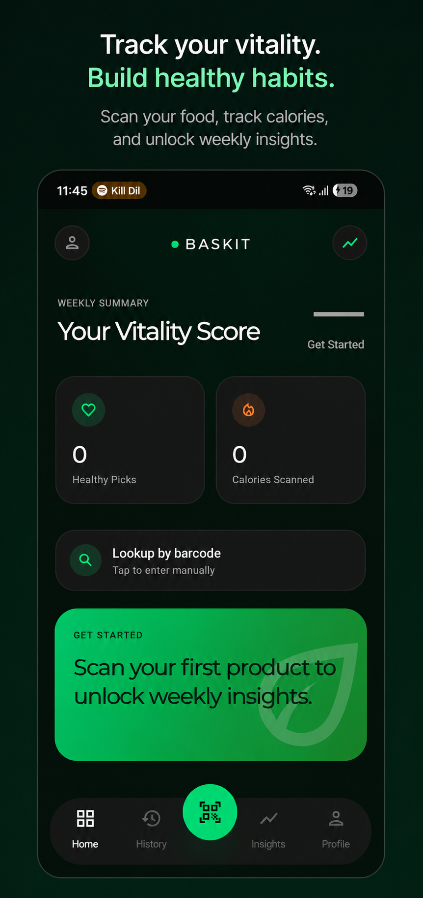
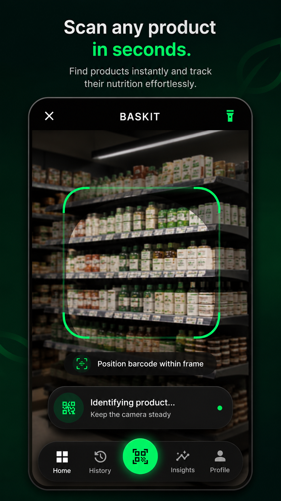
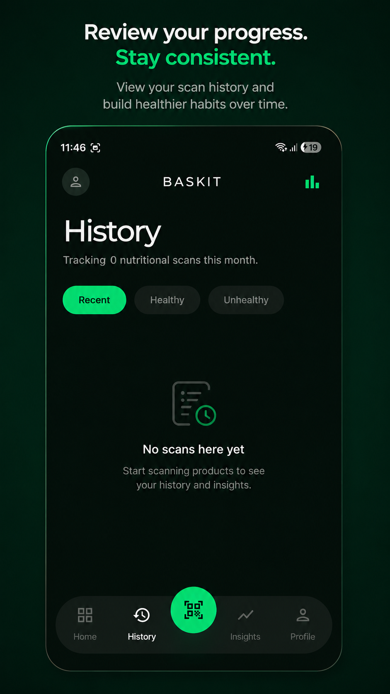
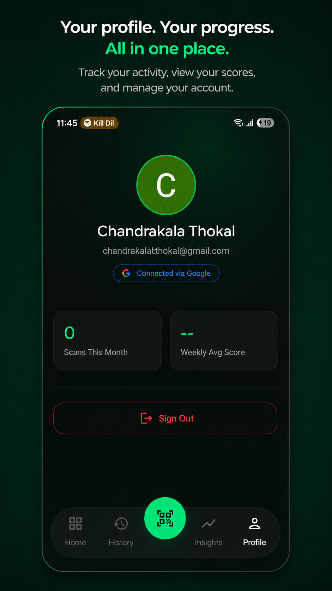

<div align="center">


# Baskit

**Scan food. Know what's inside. Build healthier habits.**

[](https://developer.android.com)
[](https://kotlinlang.org)
[](https://developer.android.com/tools/releases/platforms)
[](LICENSE)
[](https://github.com/Dev-Aditya-More/Baskit/releases)

</div>

---

## Screenshots

<div align="center">
<table>
  <tr>
    <td align="center">
      
      <br/><sub><b>Home — Vitality Score</b></sub>
    </td>
    <td align="center">
      
      <br/><sub><b>Scanner — Barcode Scan</b></sub>
    </td>
  </tr>
  <tr>
    <td align="center">
      
      <br/><sub><b>History — Scan Log</b></sub>
    </td>
    <td align="center">
      
      <br/><sub><b>Profile — Account</b></sub>
    </td>
  </tr>
</table>
</div>

---

## About

Baskit is a minimalist nutrition scanner for Android. Point your camera at any product barcode and instantly see a breakdown of its nutritional content — calories, macros, ingredients, and a calculated health grade — so you can make smarter decisions at the grocery store or at home.

Data is sourced from the [Open Food Facts](https://world.openfoodfacts.org/) open database, and your scan history is stored locally so you can track your habits over time.

---

## Features

- **Instant barcode scan** — CameraX + ML Kit detect barcodes in real time
- **Rich product details** — calories, macros, ingredient list, and a color-coded health grade
- **Vitality Score** — weekly summary of your healthy picks and total calories scanned
- **Scan history** — filterable log of everything you've scanned (Recent / Healthy / Unhealthy)
- **Google Sign-In** — Firebase Auth for a personalized profile and cross-session continuity
- **Offline-first** — all history persisted locally with Room; no account required to browse
- **Smooth onboarding** — guided intro pager with DataStore-backed completion tracking
- **Dark-first design** — Material 3 with a custom deep-green palette throughout

---

## Tech Stack

| Layer | Libraries |
|---|---|
| UI | Jetpack Compose, Material 3, Lottie |
| Navigation | Navigation Compose |
| DI | Koin 4.2 |
| Database | Room (KSP) |
| Network | Retrofit 3 + Gson |
| Camera | CameraX 1.5 + ML Kit Barcode |
| Auth | Firebase Auth (Google Sign-In) |
| Images | Coil |
| Persistence | DataStore Preferences |

---

## Architecture

Single-module **MVVM** — clean separation between Compose UI, ViewModels, and repositories.

```
feature/
├── presentation/
│   ├── screens/       # Composables (no business logic)
│   ├── components/    # Reusable UI pieces
│   └── viewmodel/     # StateFlow state, orchestrates repos
├── data/
│   ├── local/         # Room entities, DAOs
│   ├── remote/        # Retrofit API interfaces
│   └── repository/    # Wraps DAO/API, exposes Flow / suspend fns
└── domain/            # Pure formatters and transformations
```

Navigation is handled by a sealed `Screen` class with a single `AppNavGraph`. The scanner opens as a full-screen route from the FAB; product details are scoped to a nested `ProductGraph` so the ViewModel survives the Loading → Detail transition.

---

## Getting Started

### Prerequisites

- Android Studio Meerkat or later
- JDK 11+
- `google-services.json` placed in `app/` (Firebase project required for Auth)

### Build

```bash
# Debug APK
./gradlew assembleDebug

# Release APK
./gradlew assembleRelease

# Run unit tests
./gradlew test
```

The debug APK lands in `app/build/outputs/apk/debug/`.

---

## Download

Grab the latest release APK from the [Releases](https://github.com/Dev-Aditya-More/Baskit/releases) page — no build toolchain needed.

---

## Data Source

Product information is provided by [Open Food Facts](https://world.openfoodfacts.org/), a free, open, collaborative food products database made by everyone, for everyone.

---

## License

```
MIT License — Copyright (c) 2025 Aditya More
```
